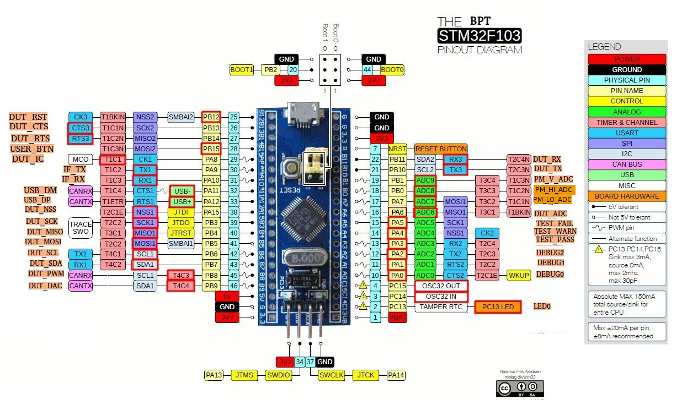

# Testing
This is intended to provide tools for embedded testing.

# Setting up the BPT (bluepill tester)

## Tools
- SWD or JTAG flasher
- Soldering iron and solder

## Materials
- [blue pill](https://hackaday.com/2017/03/30/the-2-32-bit-arduino-with-debugging/)

## Flashing BPT
1. Solder pins on the blue pill and secure the USB connector of not already done.
2. Download [firmware](bluepill_tester/QualifiedFirmware/bluepill_tester.bin) from the QualifiedFirmware folder.
3. Flash using an [SWD or JTAG interface](https://satoshinm.github.io/blog/171212_stm32_blue_pill_arm_development_board_first_look_bare_metal_programming.html).  (I usually like using the Nucleo debugger/flasher since it is cheap, has USB to Serial and support drag and drop binary).
4. If custom implementation is desired open source firmware is available in the [bluepill_tester](bluepill_tester/bluepill_tester/) folder (though it is setup with STM Workbench and STMCubeMX).

# Using the BPT
## Tools
- USB to UART converter

## Materials
- [BPT](https://hackaday.com/2017/03/30/the-2-32-bit-arduino-with-debugging/) with qualified firmware
- breadboard
- DUT (device under test)
- Jumper wires

## Running Test
(examples will use periph_i2c test)
1. Connect DUT to the testing computer.
2. Connect the BPT to the USB to UART converter.  
(pin13/PA3/RX2 of BPT <-> TX of USB to UART)  
(pin12/PA2/TX2 of BPT <-> RX of USB to UART)
3. Connect specific pins required for testing the DUT to the BPT  
(pin42/PB6/SCL1 of BPT <-> SCL0 of DUT)  
(pin43/PB7/SCK1 of BPT <-> SCK0 of DUT)
4. Flash DUT with test firmware
5. Run python script in the test folder

# BPT Pinout

# BPT Misc Info
- I2C slave address is 85 or 0x55
- Total registers are 256
- Upper registers can be read or written (152+)
- Lower registers are read only by user but can be altered with UART2 connection
- sys register is locked
- For changing configuration the registers can be set then the ex command must be used to execute changes
